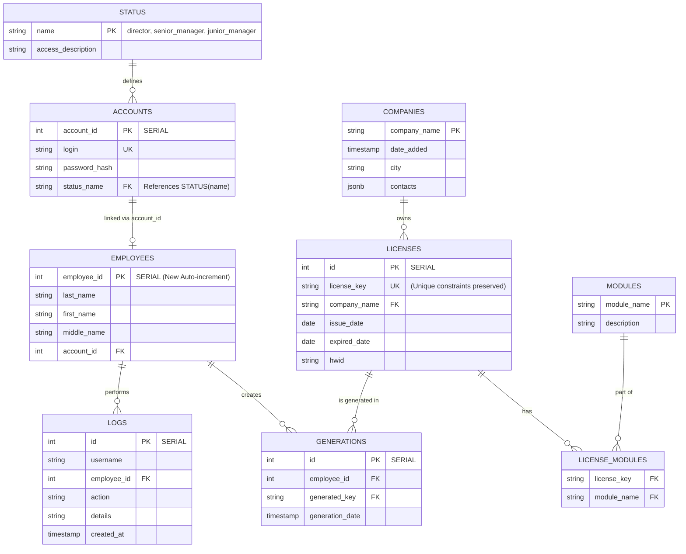

# Обновление архитектуры ServerLicense и расширение функционала

Данный план описывает реализацию 10 пунктов из технического задания: добавление функций управления сотрудниками и компаниями, рефакторинг исходного кода (`src`), безопасная миграция базы данных и настройка ротации логов.

## User Review Required

> [!CAUTION]  
> 1. В связи с изменением типов первичных ключей (`employee_id` из строки 'EMP-001' в числовой `SERIAL`), а также `licenses.id` на `SERIAL`, старые текстовые `employee_id` будут мигрированы на числовые (например, 1). Возможны кратковременные перебои при первом запуске после обновления. Данные будут **сохранены**.
> 2. Директории внутри папки `src/` будут полностью изменены. Структура проекта будет пересобрана.

> [!WARNING]  
> Роль `admin` будет переименована в `director` повсеместно в БД и в коде. Существующие пользователи-админы автоматически получат новую роль.

## Proposed Changes

---

### Архитектура Файлов
Существующий исходный код будет разделен на модули по функционалу. Также будет создана корневая директория `/logs`.
#### [MODIFY] `CMakeLists.txt`
Изменение настроек поиска исходных файлов, чтобы CMake рекурсивно компилировал папки `controllers/`, `database/`, `models/`.
#### [NEW] `/logs`
Будет добавлена новая директория. Файлы аудита (`database.log`) и системные логи (`server.log`) будут записываться сюда, а не в корень сборки ломая ее чистоту.

#### Перемещение файлов:
- **Controllers** (`src/controllers/`, `include/controllers/`) - `AuthController`, `LicenseController`, `CompanyController`, `EmployeeController`, `AuthFilter`.
- **Database** (`src/database/`, `include/database/`) - `DatabaseController`, `Migration/`.
- **Models / Services** (`src/models/`, `include/models/`) - `AppConfig`, `LicenseData`, `LicenseValidator`, и структуры вроде `LicenseRecord`.

---

### Конфигурация
#### [MODIFY] `config.json` и файлы конфигурации
Добавление новой настройки `"logsRetentionDays": 30`, которая будет указывать серверу, сколько дней хранить логи в файлах и в БД. Старые логи будут автоматически подчищаться.

---

### База Данных и Миграции (Preserving Data)
#### [MODIFY] `migration.json`
Будет добавлена **Схема версии 7**, которая безопасно применит операторы `ALTER TABLE`.
- Смена `admin` на `director`: `UPDATE status SET name='director' WHERE name='admin'` и аналогично в `accounts`.
- Смена ID лицензий: `ALTER TABLE licenses ADD COLUMN id SERIAL; ALTER TABLE licenses DROP CONSTRAINT licenses_pkey CASCADE; ALTER TABLE licenses ADD PRIMARY KEY(id); ALTER TABLE licenses ADD UNIQUE(license_key);` Плюс восстановление Foreign Keys у `license_modules` и `generations`.
- Смена `employee_id`: замена текстового ID на `SERIAL`, с сохранением привязанных к нему логов и генераций через SQL-трюк временных колонок.

---

### API Бэкенда (С++Controllers)
#### [MODIFY] `CompanyController.cpp`
Добавление роутов `PUT /api/companies/{companyName}` и `DELETE /api/companies/{companyName}`. **Доступ:** `director`, `senior_manager`.
#### [MODIFY] `EmployeeController.cpp`
Реализация роутов `GET /api/employees`, `PUT /api/employees/{id}`, `DELETE /api/employees/{id}` для CRUD операций с аккаунтами. **Доступ:** только `director`.
#### [MODIFY] `DatabaseController.cpp`
- Добавление функций обновления и удаления (SQL).
- Добавление функции `cleanupOldLogs(int days)`, которая будет вызываться при старте сервера или по крону. Функция `logAction` будет писать логи уже в новую папку `/logs/database.log`.
- Перевод **всех комментариев исходного кода** на английский язык по всему проекту.

---

### Фронтенд (UI, HTML, JS)
#### [MODIFY] `public/index.html` и `public/app.js`
- Улучшение стилизации элемента `<select>` для компаний: создание кастомного выпадающего списка в CSS, стилизованного под `glassmorphism`, поскольку дефолтный тег select плохо стилизуется.
- В модальном окне `Add Employee` поле "Employee ID" будет скрыто/удалено (теперь оно генерируется БД как SERIAL).
- Добавлены примеры: `placeholder="e.g. Иванов"`, `placeholder="e.g. Иван"`.
#### [MODIFY] `public/database.html` и `public/database.js`
- Добавление **вкладок (Tabs):** Лицензии (Licenses), Генерации (Generations - если нужно отдельно), Компании (Companies), Сотрудники (Employees - видно только директору).
- При клике на нужную вкладку рисуется соответсвующая таблица. Для Компаний и Сотрудников на каждой строке появятся кнопки `Иконка✏️ (Edit)` и `Иконка🗑️ (Delete)`.
- Роль `admin` переименована в `director` (вкладка Сотрудники не пропадёт). Вкладки и кнопки редактирования будут динамически скрыты для менеджеров.

---

## 7. Структура Базы Данных (UML Diagram)

Вы можете вставить следующий код в любой поддерживающий Mermaid онлайн редактор (например на [Mermaid Live Editor](https://mermaid.live)):

## Verification Plan
1. **Автоматические тесты**: 
   - Выполнить сборку через `cmake ..` и `make -j4` после смены путей и структуры директорий.
   - Запустить бинарник тестов GTest, чтобы проверить, что конфигурация базы данных и парсер `config.json` не сломались.
2. **Миграции и хранение данных**: Открыть интерфейс, убедиться, что старые лицензии, сотрудники и админ (с ролью `director`) успешно загружаются.
3. **Функциональные проверки**: Создать компанию, выписать лицензию, посмотреть ее во вкладках. Изменить Фамилию сотрудника под ролью `director`. Удалить компанию. 
4. **Проверка логов**: Убедиться, что логи старее X дней (из конфига) сброшены. Убедиться, что текущие логи складываются в созданную папку `logs/`.
