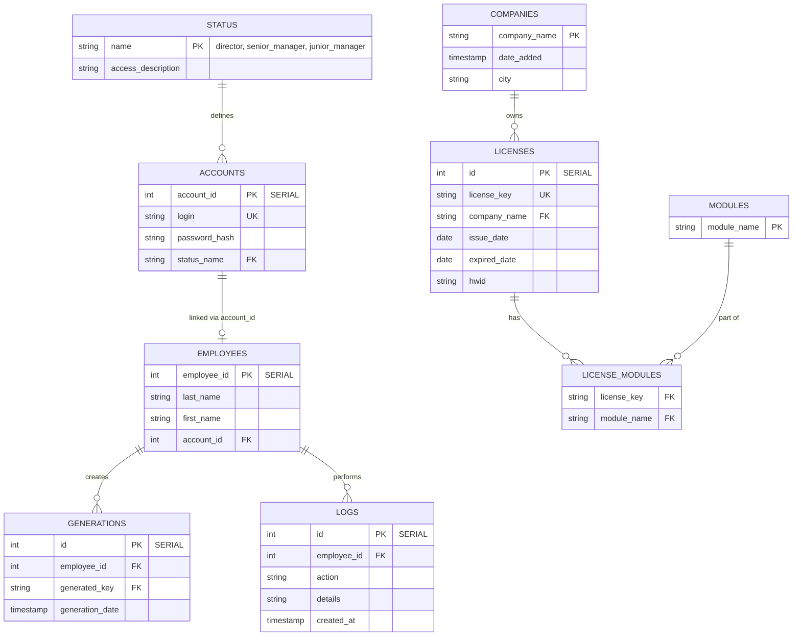

# Документация проекта ServerLicense

## 1. Обзор проекта
**ServerLicense** — это защищенное внутреннее веб-приложение для предприятия, предназначенное для генерации, хранения и управления программными лицензиями. Система предоставляет REST API, гибкое управление ролями (RBAC) и автоматизированную систему аудита.

**Технологический стек:**
- **Бэкенд:** C++ (Drogon Framework для HTTP, Qt 6 Core/Sql для работы с БД).
- **База данных:** PostgreSQL.
- **Фронтенд:** Vanilla JavaScript, HTML5, CSS3.
- **Контейнеризация:** Docker & Docker Compose.
- **Сборка:** CMake.

---

## 2. Архитектура и Структура Проекта
Исходный код разделен на функциональные модули для удобства поддержки и расширения:

- `src/controllers/` / `include/controllers/` — HTTP-контроллеры (Auth, License, Company, Employee).
- `src/database/` / `include/database/` — Уровень доступа к данным (DAO), Singleton `DatabaseController`.
- `src/models/` / `include/models/` — Модели данных, валидаторы и конфигурация (`AppConfig`).
- `src/Migration/` / `include/Migration/` — Система версионирования схемы базы данных.
- `public/` — Статические файлы фронтенда.
- `Bin/` — Внешние бинарные зависимости (динамические библиотеки).
- `logs/` — Директория для текстовых логов аудита и сервера.
- `scripts/` — Вспомогательные скрипты (бекапы, автоматизация).

---

## 3. База Данных

### 3.1 Схема (ER-диаграмма)
Приложение использует реляционную модель с автоматическим инкрементом ID (`SERIAL`) для сотрудников и лицензий.



### 3.2 Миграции
Управление схемой происходит через файл `migration.json`. При старте сервер автоматически накатывает недостающие миграции. Схема версии 7+ включает переход на числовые `SERIAL` ID и переименование роли `admin` в `director`.

---

## 4. Ролевая модель (RBAC)
Безопасность основана на трех основных статусах:
1. **`director` (бывший admin)**: Полный контроль над системой, управление учетными записями сотрудников (`CRUD`), удаление компаний и лицензий, просмотр всех журналов.
2. **`senior_manager`**: Может создавать компании, генерировать лицензии и просматривать общую базу. Запрещено удаление данных и управление сотрудниками.
3. **`junior_manager`**: Ограниченный доступ. Видит только свои генерации, не может добавлять компании или управлять чужими данными.

---

## 5. Система Логирования и Аудита
Для обеспечения безопасности используется двойное логирование:
- **База данных (таблица `logs`)**: Хранит историю критических действий (кто, когда и какую компанию удалил или какой ключ сгенерировал).
- **Файлы (`logs/`)**:
  - `database.log`: Дубликат аудита из БД.
  - `server.log`: Технические сообщения сервера (ошибки, дебаг).
- **Ротация**: Настройка `logsRetentionDays` в `config.json` определяет период хранения логов (по умолчанию 30 дней).

---

## 6. Развертывание и Docker

### 6.1 Быстрый запуск
Приложение полностью контейнеризировано. Для запуска на сервере (Debian) достаточно Docker и Docker Compose:

```bash
cp .env.example .env   # Настройте пароли
docker compose up -d --build
```

Подробные инструкции по установке и настройке ОС приведены в [DEPLOYMENT_GUIDE.md](file:///home/vladimir/Work/Server%28Drogon%29/ServerLicense/DEPLOYMENT_GUIDE.md).

### 6.2 Резервное копирование
Система включает автоматический sidecar-контейнер `backup`, который создает дампы базы данных ежедневно.
- **Хранение**: Локально в директории `./backups/`.
- **Глубина архива**: 7 дней (старые копии удаляются автоматически).

---

## 7. Разработка и Тестирование
- **Сборка:** `mkdir build && cd build && cmake .. && make`
- **Тесты:** Используется Google Test (GTest). Запуск: `./build/ServerLicenseTests`
- **Конфигурация:** Основные настройки порта и БД находятся в `config.json`, но могут быть переопределены через переменные окружения в Docker.
